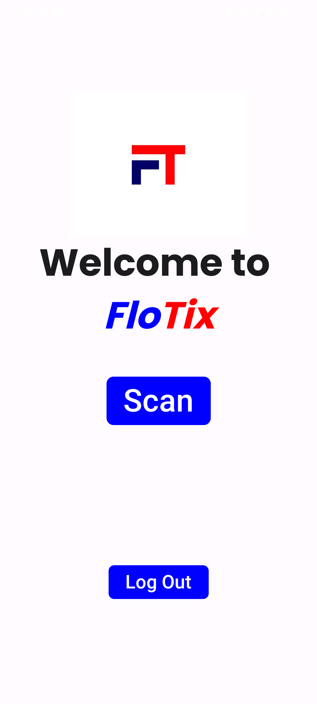
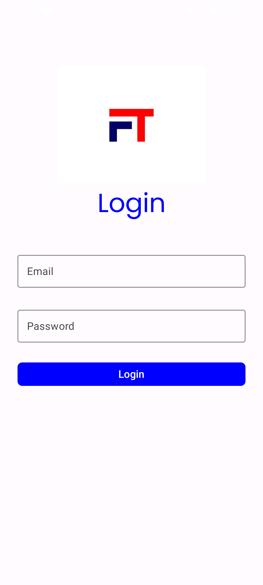
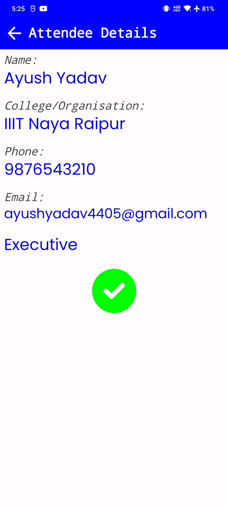
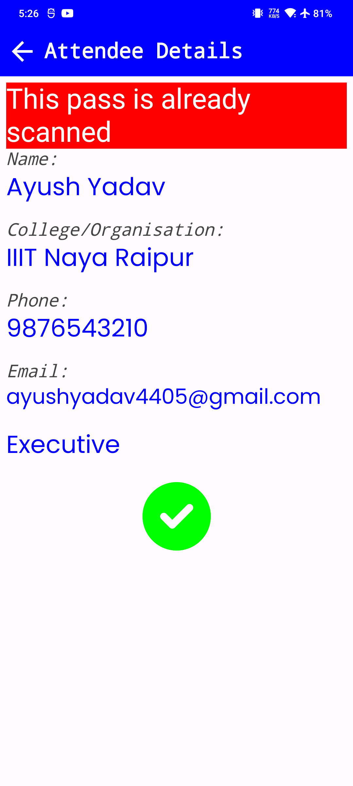

# FloTix

A mobile application for scanning QR codes to validate e-tickets. Only registered users can scan QR codes, ensuring secure access control.

## Features

- 🔐 **Firebase Authentication** – Only registered users can scan QR codes.
- 📷 **QR Code Scanner** – Uses CameraX and ML Kit for fast and accurate scanning.
- 🎯 **Auto-Stop Scanning** – Prevents multiple scans of the same QR code.
- 📊 **Firestore Integration** – Fetches and displays data from Firestore.

## Working

- This project has two parts
  1. Sending QR tickets to the registered users using a Google Sheets AppScript.
  2. Verifying the tickets using an Android app.
- Here is a sample [Google Sheet](https://docs.google.com/spreadsheets/d/1qLaVNJ6_vVdWjUwSAMqMsGMV0p3UmNtpzeVHwYW4x74/edit?usp=sharing), which shows the format in which data is collected for uploading to data store
- The AppScript at `appScript/FirestoreUpload.js` sends a QR ticket to the registered e-mail addresses in the sheet, and uploads the data fields(Name, College Name, Email, Phone, and Ticket Type) to Firestore.
- It also makes sure that a ticket is not sent multiple times.
- The QR code is the encoded payment ID of the transaction made by the user to buy the ticket.
- The encoded payment ID is also the document ID of the ticket in Firestore.
- Then when the ticket is scanned in the FloTix app, the QR code is decoded and the document ID is fetched from Firestore.
- The details from the ticket are shown in the app, and the verifier can mark the ticket as scanned, which is updated in Firestore, so if a ticket is scanned again, an alert is shown.

## Screenshots

<p>
    
    
    
    
</p>

## Installation

1. **Clone the repository**:
   ```sh
   git clone https://github.com/scifre/flo-tix.git
   cd flo-tix
   ```
2. **Set up Firebase**:
    - Create a Firebase project.
    - Enable Authentication (Email/Password Sign-in method).
    - Add users to allow them to Sign-In to the app.
    - Enable Firestore Database.
    - Create a collection named `attendees` in Firestore.
    - Download `google-services.json` and place it in `app/` directory.
3. **Compile the app**:
    - Open the repo in Android Studio and build the app
    - Create a release build for better performance and save the apk.
3. **Set up Google Sheets**:
    - Create a google sheet in this [format](https://docs.google.com/spreadsheets/d/1qLaVNJ6_vVdWjUwSAMqMsGMV0p3UmNtpzeVHwYW4x74/edit?usp=sharing) or copy this one
    - Go to Extensions > AppScript.
    - Create a new AppScript project.
    - Copy the code from `appScript/FirestoreUpload.js` and paste it in the editor. save the file and open the Sheet.

## Usage
- Open the Google Sheet
- Enter the details of the person whom you want to send the ticket.
- Click on Send Tickets > Send Emails.
- Open the e-mail in which the ticket is received.

- **Login** to the app using the credentials entered updated in the Firebase Authentication.
- **Scan a QR Code** using the built-in scanner.
- **View Results** – The scanned data is processed and displayed.

## Technologies Used

- **Kotlin & Jetpack Compose** – UI development.
- **Firebase Authentication** – Secure user login.
- **Firestore Database** – Stores scanned data.
- **Google ML Kit** – QR code detection.
- **CameraX** – Camera handling.

## Contributing

Contributions are welcome! Feel free to fork this repository and submit pull requests.

## License

This project is licensed under the MIT License.

